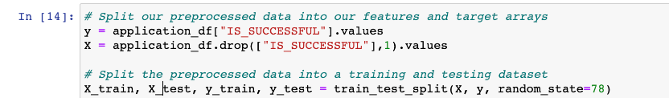
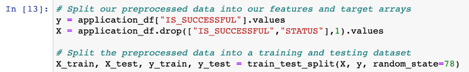
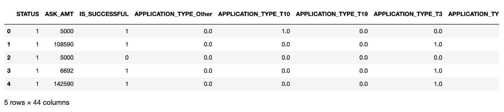
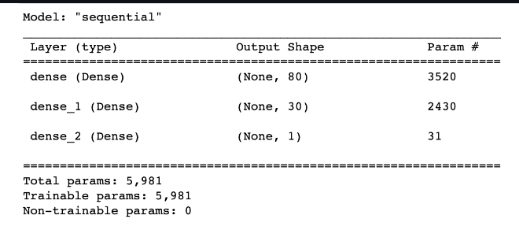
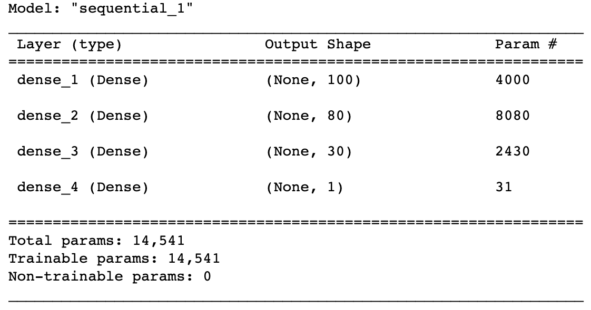
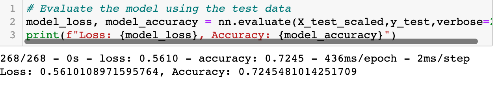

# Neural_Network Charity Analysis

# Overview

In this project I will create a binary classifier model that will predict if the applicants will be successful in being funded by the Alphabet Soup. I will also being optimizing the models to see if the accuracy can be improved. With the CSV file that contains 34,000 organizations that have gotten funding from the Alphabet Soup .
These following are the columns that capture the metadata about each organization: 
- EIN and NAME—Identification columns
- APPLICATION_TYPE—Alphabet Soup application type
- AFFILIATION—Affiliated sector of industry
- CLASSIFICATION—Government organization classification
- USE_CASE—Use case for funding
- ORGANIZATION—Organization type
- STATUS—Active status
- INCOME_AMT—Income classification
- SPECIAL_CONSIDERATIONS—Special consideration for application
- ASK_AMT—Funding amount requested
- IS_SUCCESSFUL—Was the money used effectively

# Reults from testing

Data Preprocessing:

- What the variables are considered for targets in my model?
- IS_SUCCESSFUL is that target variable for this model

- What variable(s) are considered to be the features for your model?
- the features are the following APPLICATION_TYPE, AFFILIATION, CLASSIFICATION, USE_CASE, ORGANIZATION, STATUS, INCOME_AMT, SPECIAL_CONSIDERATIONS, ASK_AMT are features for the model.

- What variable(s) are neither targets nor features, and should be removed from the input data?
- The EIN and NAME does not add any significant value to the model so we will remove this.

# Compiling, Training, and Evaluating the Model
- How many neurons, layers, and activation functions did you select for your neural network model, and why?
- I took 3 layers and they have 100,80,30 neurons respectivley. I chose the relu because for input data and sigmoid for output layer because its binary classification problem and those activations have strong history of success.

- Were you able to achieve the target model performance?
- the performance I got was 72.4% which was lower than the target of 75%

- What steps did you take to try and increase model performance?
- I tried to improve it by the following methods:
1. Removed "status" variable 
2. tried different activation functions
3. And finally tried changing the number of epochs

# Summary 
In the end after various modifications to the model I was able to reach the best of 73%. We could try other models other than the Sequential like random forest or change the size of the data to improve accuracy. Overall the models needs improvment and a sub 75% accuarcy can be achieved.

